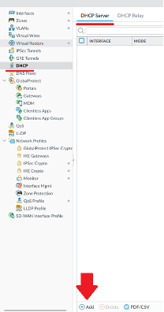

# Palo Alto Networks Cybersecurity Academy – Setting up a PA220 Firewall for a SOHO Environment
### Purpose
This lab expands on the knowledge from our previous NHS cybersecurity lab by teaching students how to set up the PA220 for a small-scale SOHO network, which is the primary use case for the device. This lab covers skills such as setting up DHCP services and trust boundaries on a router, which are essential for basic network functions and security.
### Background
SOHO, short for Small Office/Home Office, is a network type commonly used by individuals or small businesses with less than 10 employees. This network type commonly uses smaller-scale routers, switches, and firewalls compared to their large enterprise counterparts. SOHO networks provide numerous advantages to teams of 1-10 people as they are easier to set up and are more affordable than full-size network equipment. SOHO networks often only have a single router, and may contain switches, wireless access points, and end devices such as computers and printers.  
Palo Alto Networks is a networking and cybersecurity company from Santa Clara, California. They are a member of the S&P 500. They focus mainly on the business market, creating scalable security solutions for many of the largest companies worldwide. 
The Palo Alto PA220 is a firewall sold by Palo Alto Networks. Contrary to Palo Alto’s main market, the PA220 is intended for small office/home office solutions. Marketed as a NGFW, or Next-Generation Firewall, the PA220 uses machine learning to identify attacks instead of relying on a simple signature check like traditional firewalls. This technology allows the PA220 to identify undocumented threats and brand-new exploits without intervention from Palo Alto networks themselves. The PA220 also prevents threats by filtering URLs and securing against DNS-based attacks. As of January 31, 2023, it is no longer being sold, and it will reach end-of-life on January 31, 2028.  
The PA220 doesn’t have a fan, and instead uses hexagon-shaped vents to passively filter air. The firewall’s compact form factor allows it to easily fit alongside existing network devices. 
Palo Alto firewalls run on an operating system called PAN-OS. PAN-OS can be controlled through two methods: a Graphical User Interface (GUI) and a Command-Line Interface (CLI). The GUI is accessible through an HTTP connection and displays in any modern web browser. The HTTP connection is available through the firewall’s MGT port and by default, is accessible at http://192.168.1.1. The firewall has a default username and password of admin. 
The latest version of PAN-OS is PAN-OS 11.2 Quasar, which was released in May 2024. In this lab, our firewall is running PAN-OS 8, which has reached end of life and is no longer supported. 
PAN-OS’s GUI has a variety of settings and tools to control advanced functionality of the router. The GUI’s default page is a dashboard that displays vital information, such as console messages and link states of ports.
### Lab Summary
In this lab, we configured our firewall to connect to a DHCP-enabled ISP router and configured this traffic to be untrusted by default. We then configured the remainder of the router ports to be connected by a single VLAN, have trusted traffic, and be DHCP clients served by the firewall.
### Lab Commands
Make sure the PA220 is connected to power and that the STAT, TEMP, and PWR lights are green. Connect an ethernet cable from the MGT port to a PC. Set the PC’s IP address to 192.168.1.2 with a subnet mask of 255.255.255.0.
 
In a web browser, connect to 192.168.1.1. (Note: only some browsers are officially supported. Firefox works universally, Chrome works on Windows and MacOS 
You should see a login page. Log into the default account, which has the username and password *admin*. 

 
After a login, you will be prompted to reset the administrator’s password. Choose a secure password to keep your firewall secure.
Connect the ethernet1/1 port of the firewall to the router provided by your ISP.
In the PA220’s dashboard, go to the *Interfaces* section of the *Network* tab. 
 
Under *ethernet1/1*, change the interface type to *Layer3*, the virtual router to *default*, and under *Security Zone*, click *New Zone*. 
 
 
Name this zone *Untrust-L3*. This zone will be used for untrusted IP traffic on the connection to the ISP.
Click on the *IPv4* section. Set the type to *DHCP Client* and ensure that *Automatically create default route pointing to default gateway provided by server* is enabled. 
 
Next, go to the *Virtual Wires* section, select *default-vwire*, and click *Delete*. 
 
Return to the *interfaces* tab. Under *ethernet1/2*, set the interface type to *Layer2*, and under *VLAN*, click *New VLAN*. 
 
Name this VLAN *VLAN Object* and set the VLAN Interface to *vlan*. 
 
Under *Security Zone*, click *New Zone*. Name this zone *Trust-L2*. 
 
Repeat this process for interfaces *ethernet1/3* through *ethernet1/8* using the VLAN and Security Zone created for *ethernet1/2*. These ports will be used for trusted traffic on the local network. 
Go to the *VLAN* section of *Interfaces* and click on *vlan*. 
 
Set the virtual router to *default* and create a new security zone called *Trust-L3*.  
 
This VLAN will be used as a gateway for all hosts connected to the firewall. Go to the *IPv4* tab and click *Add* under the *IP* section. 
 
Create a new address and name it *Gateway*, assigning it an appropriate description. Choose a subnet for your local network and set the IP to an address within this subnet. In this lab, we used the last host address in the 192.168.1.0/24 network. 
 
Next, set up the DHCP server. Go to the *DHCP* section and click *Add*. 
 
Set the interface to *vlan* and the mode to *enabled*. Click *Add* under *IP Pools* and add all the assignable addresses in the subnet. In this case, the IP range was 192.168.1.2-192.168.1.253. 
 
Go to the *Options* tab. Set the gateway/mask to the IP/mask assigned to the vlan interface (In this case, 192.168.1.254 and 255.255.255.0). Set the primary and secondary DNS to valid DNS servers (In this case, we used Cloudflare’s DNS servers, 1.1.1.1 and 1.0.0.1). 
 
Go to *Objects* > *Security Profile Groups* and click the *Add* button. Set the name to *Internet*, the anti-spyware profile to *strict*, and the vulnerability protection profile to *strict*. 
 
Go to *Policies* > *Security* and click the *Add* button. Name this policy *Internet Outgoing* and set the description to *All traffic to the internet*. This policy will be implemented on *ethernet1/1*, the connection to the ISP. 
 
Go to the *Source* tab and set the source zone to *Trust-L3*.  
 
Go to the *Destination* tab and set the destination zone to *Untrust-L3*.  
 
Go to the *Actions* tab and set the Action Setting to *Allow*. 
 
Next, go to the *NAT* section of the *Policies* tab and click the *Add* button.  
 
Name it *Internet Outgoing*. 
 
Under *Original Packet*, set the source zone to *Trust-L3*, the destination zone to *Untrust-L3*, and the destination interface to *ethernet1/1*. 
 
Under *Translated Packet*, set the translation type to *Dynamic IP and Port*, the address type to *Interface Address*, and the interface to *ethernet1/1*. 
 
Next, go to *Device* > *Setup* > *Interfaces* and click *Management*.  
 
Set the IP address/netmask to your desired settings (in this case, we used 192.168.1.1 and 255.255.255.0). Set the default gateway to the IP of the VLAN interface (in this case, 192.168.1.254). 
 
Next, switch to the *Services* tab, and click the gear next to *Services*.  
 
Set the update server to *updates.paloaltonetworks.com* and set the DNS servers to your desired DNS service (in this lab, we used Cloudflare’s DNS, 1.1.1.1 and 1.0.0.1). 
 
Finally, click the *Commit* button in the top-right corner. In the resulting window, click *Commit* again. 

 
Go to the *Dashboard* tab. 
 
Look under the *System Logs* section. You can confirm that the external DHCP service is working if you see that an IP has been assigned to the *ethernet1/1* interface. 
 
Connect PC 1 and PC 2 to the *ethernet1/2* and *ethernet1/3* ports of the firewall. Connect the *MGT* port of the firewall to any unused port from *ethernet1/4* to *ethernet1/8* (in our lab, we used port *ethernet1/7*). Set both PCs to obtain an IP address automatically.  
 
On either PC, open the command prompt and type *ipconfig*.  
 
If you see an address in your DHCP address pool, DHCP is working correctly. 
 
Next, from the command prompt, ping a website on the internet (such as www.google.com). If you get a reply, internet connectivity is working correctly. 
 
### Network Diagram

### Problems
**Virtual Wire**
By default, *ethernet1/1* and *ethernet1/2* are connected by a virtual wire, which causes the ports to act as a direct connection to each other and lose their ability to route and switch traffic. 
Originally, we ran into an error with our commit, as while the interfaces had been changed to Layer 3 and Layer 2 respectively, the firewall still had an unbound virtual wire. 
This error was fixed by going to the *Virtual Wires* section of the *Network* tab, selecting *default-vwire*, and clicking *Delete*, as shown in the Lab Commands section above.
### Conclusion
The PA220’s web interface was confusing to navigate at first, but after configuring the firewall for a SOHO network, I believe I have gained a strong understanding of how to navigate PAN-OS’s interface. All in all, a SOHO network configuration using a PA220 firewall had a relatively simple setup process and would work great for an individual or small business.